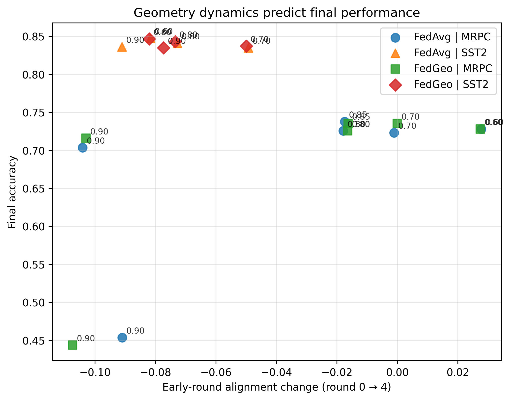
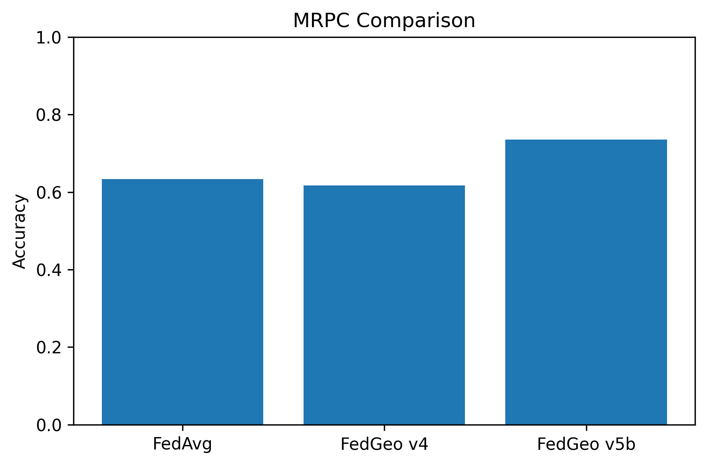
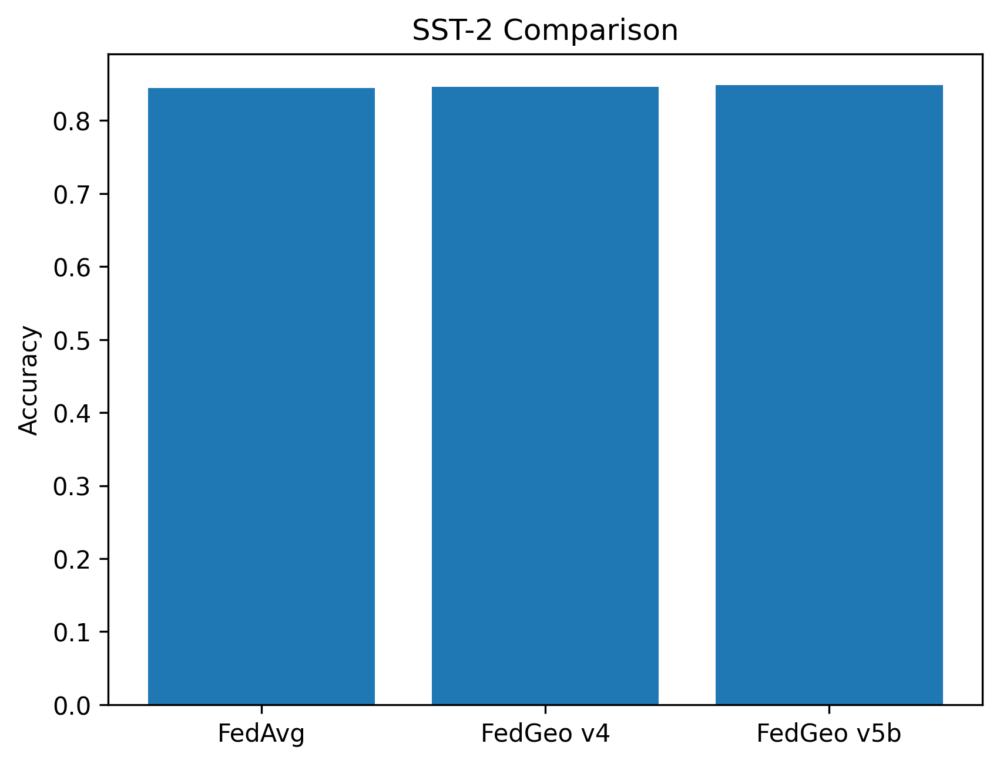
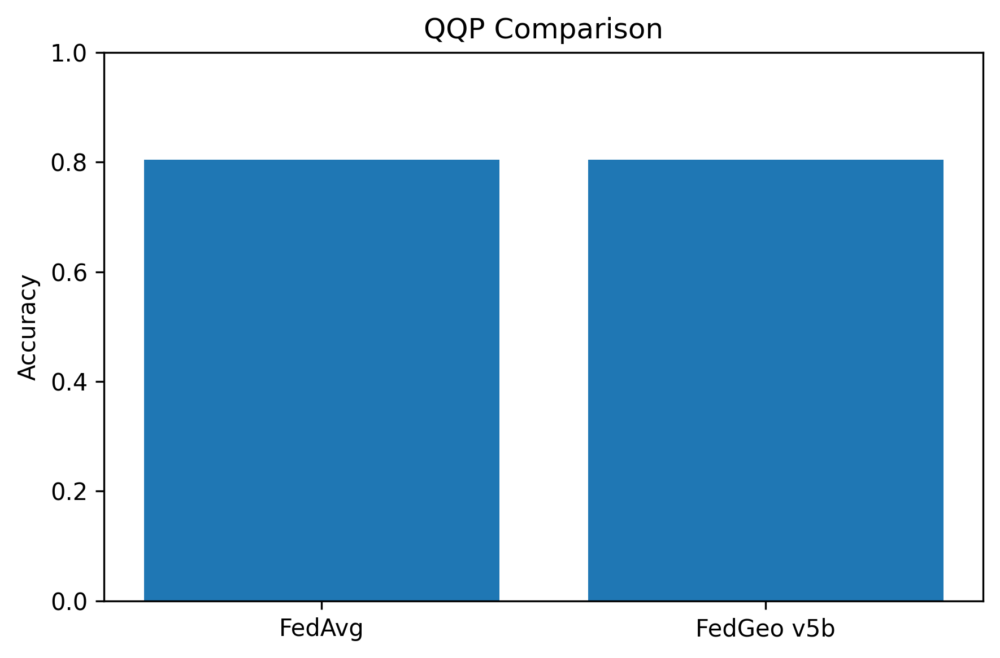
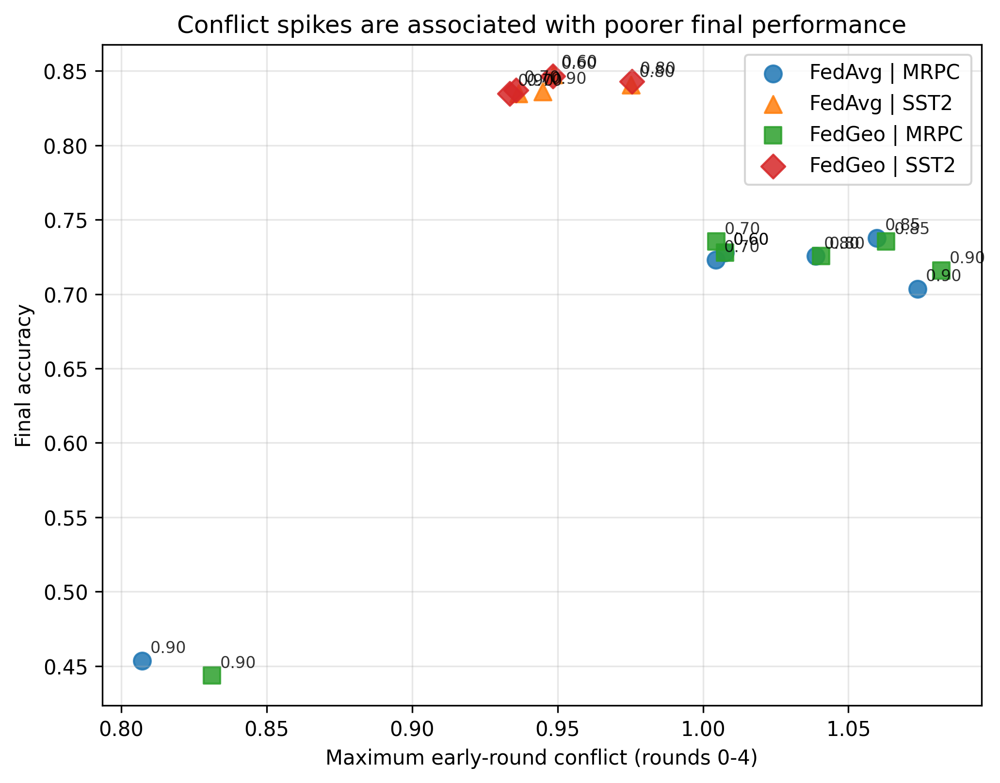
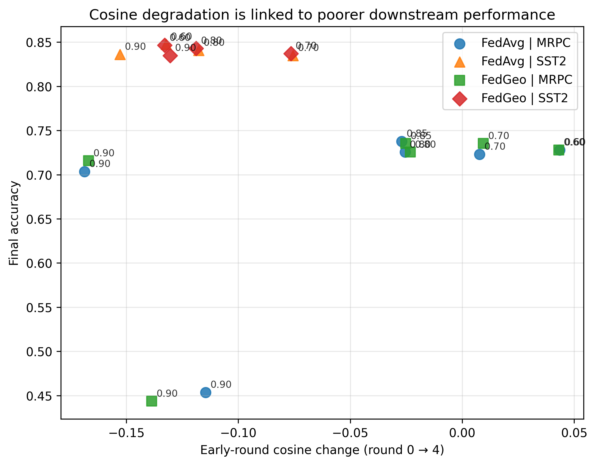

# When Federated LoRA Fails

<p align="center">
  
</p>

<p align="center">
<b>Geometry dynamics and instability in federated parameter-efficient fine-tuning under heterogeneous data.</b>
</p>

---

## Overview

This repository studies instability in federated LoRA under heterogeneous client distributions.

We analyze how the geometry of client updates, including cosine similarity, alignment, and conflict, evolves during training, and how these signals relate to final performance.

<p align="center"><b>Training outcomes are largely determined by early-round geometry.</b></p>

---

## Key Idea

Federated LoRA does not fail randomly.

- High alignment → stable convergence  
- Low alignment / conflict → failure  

Early geometry provides a strong predictive signal for final performance.

---

## Results

### Main Comparison

<p align="center">
  
  
  
</p>

---

### Geometry Predicts Performance

<p align="center">
  
  
  
</p>

---

### Performance Summary

| Task | Method | Mean Accuracy | Std |
|------|--------|---------------|-----|
| SST-2 | FedAvg | 0.8448 | 0.0136 |
| SST-2 | **FedGeo v5b** | **0.8486** | 0.0068 |
| MRPC | FedAvg | 0.6332 | 0.0873 |
| MRPC | FedGeo v5b | 0.7353 | — |
| QQP | FedAvg | 0.8050 | — |
| QQP | FedGeo v5b | 0.8050 | — |

---

### Controlled MRPC Study

| DR | Method | Runs | Mean Acc | Std | Bad Run Rate |
|----|--------|------|----------|-----|--------------|
| 0.7 | FedAvg | 8 | 0.6998 | 0.0466 | 0.125 |
| 0.7 | FedGeo | 8 | 0.6982 | 0.0469 | 0.125 |
| 0.9 | FedAvg | 8 | 0.6085 | 0.1374 | 0.375 |
| 0.9 | FedGeo | 8 | 0.6032 | 0.1405 | 0.375 |

---

## Key Findings

- Early geometry predicts final performance (r ≈ 0.43)  
- Instability is driven by geometric conflict  
- Heterogeneity increases variance  
- Geometry-aware aggregation helps but does not fully solve instability  
- Scaling significantly worsens performance  

---

## Usage

```bash
python scripts/run_experiment.py --config configs/glue/<config>.yaml
```

---

## Experimental Setup

- Model: DistilBERT + LoRA  
- Clients: 50  
- Clients per round: 25  
- Tasks: MRPC, SST-2, QQP  
- Heterogeneity: label skew (DR = 0.7, 0.9)  
- Multi-seed evaluation  

---

## Reproducibility

To reproduce results:

1. Use configs in `configs/`  
2. Fix random seeds  
3. Run multiple seeds  
4. Aggregate results using analysis scripts  

---

## Limitations

- Geometry-aware aggregation does not fully resolve instability  
- Extreme heterogeneity remains challenging  
- Some results require further multi-seed validation  

---

## Status

Active research codebase.
